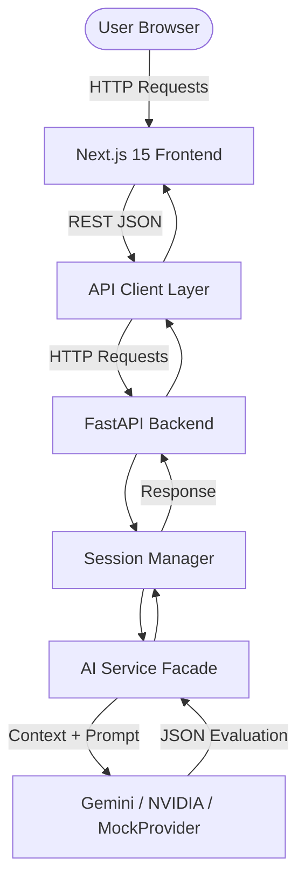
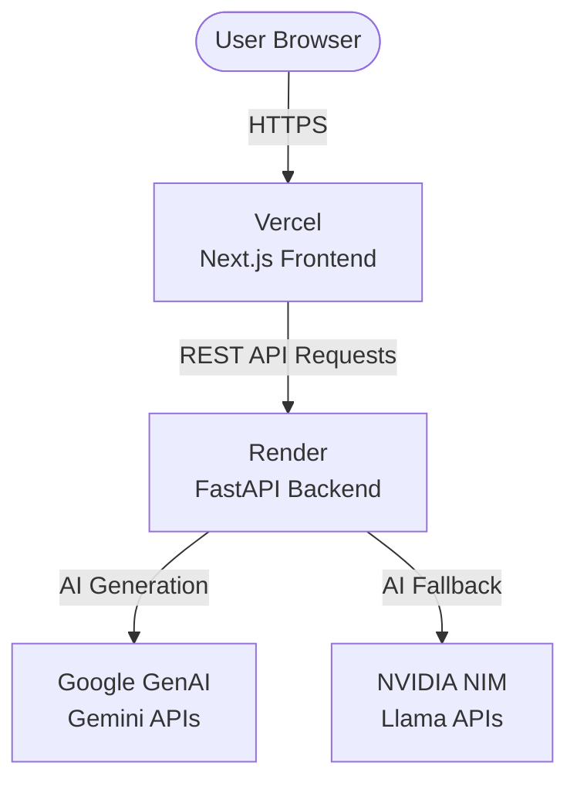
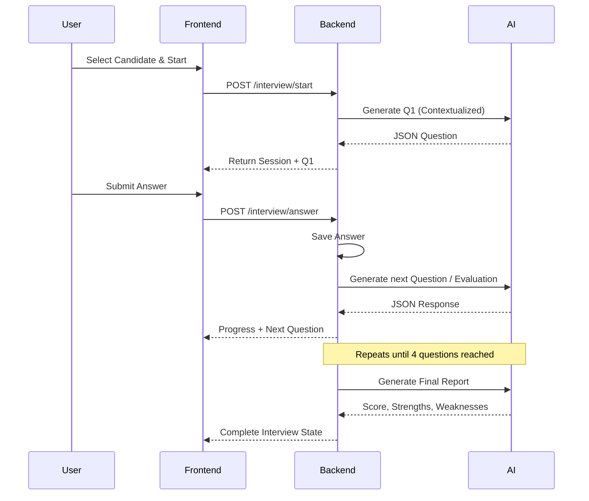
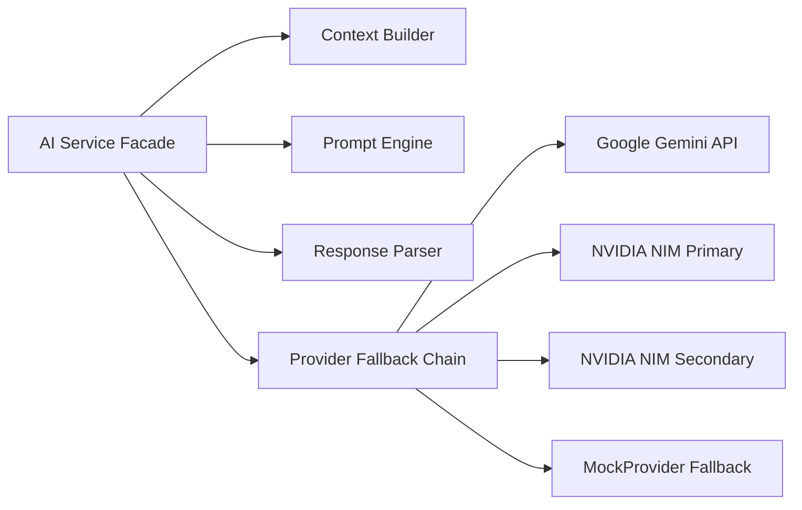

# NovaForge

NovaForge is a production-grade AI-powered technical interview system built for the ViCodathon 2026 hackathon. It dynamically generates context-aware, personalized technical interviews by analyzing a candidate's curriculum progress, historical learning signals, and experience profile.

## 🚀 Live Demo

[https://novaforge-vicodathon.vercel.app](https://novaforge-vicodathon.vercel.app)

## 🎥 Demo Video

- [LinkedIn Demo Video](https://www.linkedin.com/posts/vineetkhatri375_vicodathon-aihackathon-artificialintelligence-ugcPost-7492171799812665344-gUE_/)
- [GitHub Demo Video](LINK_TO_GITHUB_VIDEO)

## 💻 GitHub Repository

[https://github.com/Vineet375/NovaForge-ViCodathon](https://github.com/Vineet375/NovaForge-ViCodathon)

## 🏆 ViCodathon

Built for **ViCodathon 2026** — India's AI-First 48-Hour Vibe Coding Hackathon.

## 📌 Problem Statement

Traditional technical screenings are generic and one-size-fits-all. They fail to account for a candidate's specific training program, their demonstrated performance (such as missions passed, skipped, or retried), or the difficulty level appropriate for their seniority and track record.

## 💡 Solution

NovaForge builds a precise learning profile for each candidate and uses it as the primary context for all AI-generated questions, evaluations, and final feedback. Unlike generic interview tools, NovaForge understands exactly what the candidate has studied and tailors every question to their specific curriculum journey.

## ✨ Key Features

- **Dashboard**: High-level metrics showing active sessions, total candidates, and curriculum modules.
- **Candidate Management**: Select from predefined candidate personas with unique learning profiles.
- **Curriculum System**: Tracks candidate progress through structured curriculum days and modules.
- **AI-generated Interview Questions**: Gemini and NVIDIA models dynamically generate personalized questions.
- **Multi-question Interview Sessions**: Structured flow generating exactly 4 targeted questions.
- **Answer Submission**: Candidates submit answers to technical questions.
- **Interview Progress Tracking**: Visual indicators track progress through the 4-question session.
- **Final AI Evaluation**: Background AI evaluation produces a holistic performance report.
- **Score, Strengths, & Growth Areas**: Evaluates answers to provide a final score (out of 10), key strengths, and growth areas.
- **Light/Dark Mode**: Full theme support across the application UI.

## 🏗️ System Architecture



## 🌐 Deployment Architecture


- **Frontend** → Vercel
- **Backend** → Render

## 🔄 Application Workflow



## 🤖 AI Integration Architecture



## 🔑 AI/API Services & Environment Variables

NovaForge utilizes a robust, highly available AI fallback chain to guarantee interview generation even during API outages.

| Service | Purpose | Environment Variable | Used By | Required? | Fallback |
|---------|---------|----------------------|---------|-----------|----------|
| Google Gemini | Primary AI generation | `GEMINI_API_KEY_1` | AI Service | Yes | Gemini Key 2 |
| Google Gemini | Failover API Key 2 | `GEMINI_API_KEY_2` | AI Service | No | Gemini Key 3 |
| Google Gemini | Failover API Key 3 | `GEMINI_API_KEY_3` | AI Service | No | NVIDIA Primary |
| NVIDIA NIM (Llama 3.3) | Primary Fallback LLM | `NVIDIA_API_KEY_1` | AI Service | No | NVIDIA Secondary |
| NVIDIA NIM (Llama 3.1) | Secondary Fallback LLM | `NVIDIA_API_KEY_2` | AI Service | No | MockProvider |

*Note: All external API calls feature bounded timeouts (5-10s) and automatically cascade down the provider chain if rate limits or network failures occur.*

## 🧠 Interview Generation & Evaluation Flow

1. Candidate context and curriculum data are loaded by the Backend.
2. Backend passes Candidate Profile and Curriculum progress to the ContextBuilder.
3. ContextBuilder constructs a dense prompt outlining the candidate's exact experience level and required topic.
4. The AI Provider generates a strictly formatted JSON technical question, avoiding duplicates via local similarity checks (`difflib`).
5. Candidate submits their answer on the Frontend.
6. Backend saves the answer and triggers a background AI task.
7. The interview state advances, asking exactly 4 targeted questions.
8. Upon completion, the AI generates a final holistic evaluation report containing an overall score (out of 10), key strengths, and growth areas.

## 🎯 Candidate & Curriculum System

The platform dynamically adjusts interview difficulty based on:
- **Completed Missions**: Signals the candidate's actual capability.
- **Experience Level**: Differentiates Junior vs Senior expectations.
- **Curriculum Alignment**: Focuses on specific days (e.g. Next.js, RAG pipelines) the candidate has studied.

## 📊 Dashboard & Analytics

The Next.js dashboard presents high-level system statistics:
- Active interview sessions
- Total tracked candidates
- Total available curriculum modules

## 🔌 API Architecture

The Next.js frontend strictly communicates with the FastAPI backend through a dedicated REST client.

| Endpoint | Method | Purpose |
|----------|--------|---------|
| `/health` | `GET` | System health check |
| `/dashboard` | `GET` | Aggregate dashboard statistics |
| `/candidates` | `GET` | List all available candidates |
| `/curriculum` | `GET` | Retrieve structured curriculum data |
| `/interview/start` | `POST` | Initialize a new interview session |
| `/interview/{id}` | `GET` | Retrieve active interview state |
| `/interview/{id}/answer` | `POST` | Submit an answer |
| `/interview/{id}/next` | `POST` | Retry/Force next generation step |
| `/interview/{id}/feedback` | `GET` | Retrieve the final evaluation report |

## 🛡️ Security & Environment Variables

**No secret values or API keys are exposed or committed to the repository.**
All sensitive credentials must be configured securely on the deployment host.

- `NEXT_PUBLIC_API_URL`: Directs the frontend to the deployed backend.
- `FRONTEND_ORIGINS`: Configures CORS safely on the FastAPI backend.
- `ENVIRONMENT`: Sets logging verbosity (`development` | `production`).
- `PORT`: Explicit host port binding.

## 🧪 Testing & Verification

The final deployment and logic have been rigorously verified:
- **Production Verification:** Frontend dashboard, candidate selection, and interview flows verified successfully on Vercel/Render.
- **API Resiliency:** Fallback behavior, API timeouts, and 429 rate limit cascades tested thoroughly via simulation scripts.
- **Backend Test Suite:** 100% passing automated test suite (`pytest -v`) verifying AI logic, deduplication, JSON parsing, and domain state machine transitions.
- **Git State:** Documentation-only commits verified via `git diff --check`.

## 🛠️ Technology Stack

**Frontend:**
- Next.js 15
- React 19
- TypeScript 5
- Tailwind CSS v4

**Backend:**
- Python 3.13
- FastAPI
- Uvicorn
- Pydantic
- Google GenAI SDK
- OpenAI SDK (for NVIDIA NIM integration)

## 📁 Project Structure

```
NovaForge - ViCodathon/
├── backend/
│   ├── api/                 # API routing and schema contracts
│   ├── data/                # Static JSON mock data
│   ├── models/              # Pydantic domain models
│   ├── services/            # Domain logic and AI Provider Facade
│   └── tests/               # Pytest automated suites
├── docs/
│   └── technical-spec.md
├── frontend/
│   ├── src/app/             # Next.js App Router
│   ├── src/components/      # React UI components
│   ├── src/hooks/           # Client-side API management
│   └── src/lib/             # Typed API fetch client
├── .env.example
└── requirements.txt
```

## 📚 Documentation

- [AI Usage Log](AI_USAGE_LOG.md): Documents how agentic AI and LLMs were used to scaffold and assist development.
- [Prompt History](PROMPT.md): Preserves the exact chronological log of AI prompts, architectural decisions, and iterative milestones.
- [Final Documentation](FINAL_DOCUMENTATION.md): High-level summary of the finalized project architecture and features.

## 🤖 AI-Assisted Development

This project was built during a 48-hour AI-assisted hackathon. Extensive use of LLMs was employed for boilerplate generation, state-machine design, latency optimizations, and complex architectural debugging. For a detailed breakdown of what AI contributed vs what was manually verified, refer to the [AI Usage Log](AI_USAGE_LOG.md).

## 👥 Team NovaForge

Built with ❤️ by **Team NovaForge** for the ViCodathon 2026 hackathon.

## 📜 License / Hackathon Information

MIT License — see [LICENSE](LICENSE) for details.
